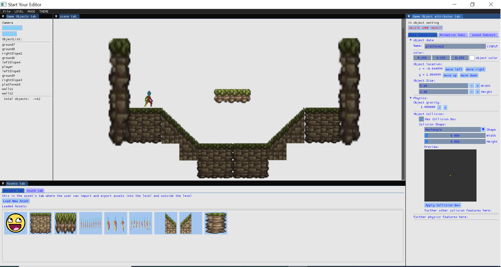

# Start-Your-Engine
Capstone group project. We created a game engine from scratch using OpenGL and c++.



To get started:


clone the repository using the recursive flag

```
git clone --recursive <repository_url>
```
    
 or clone normally and run:

```
git submodule init
git submodule update
```

run the premake script to build project files for your system
configured for windows pcs only so far

```
premake/premake5 vs2022
```


open the project in your IDE and build the demo 


Credit to:
https://zegley.itch.io/2d-platformermetroidvania-asset-pack for character assets

learnopengl.com for boilerplate code

box2d for 2D pyhsics library

glm for openGL math library

stb_image for image loading

SoLoud for a sound library

ImGui for creating a interactive level editor.
